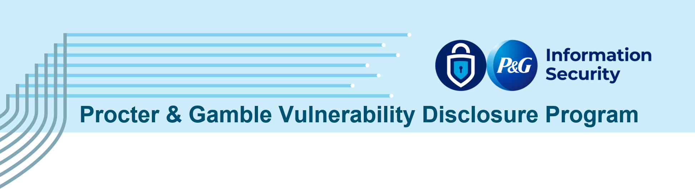
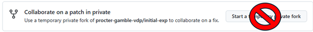

>_NOTE: This README outlines expecations and provides examples for the submission process. Before submission, fully read and understand our [Security Policy](https://github.com/procter-gamble-vdp/submissions/blob/main/SECURITY.md)._

________________
# Expectations for Submitting a Security Advisory
Since the standard Github Security Advisory template is designed for reporting bugs and security findings in code, we expect many Vulnerability Disclosure Program (VDP) findings will fall outside of this scope. To support this need, use the “Other” Ecosystem option and the main Description field to support the VDP requirements in the report. 

While Title and Description are the only default required fields, providing data for the optional fields may accelerate the review process.
>_NOTE: We will NOT use the temporary private fork or publish features._

All vulnerabilities reported to P&G will be Closed when:
- Reviewed and REJECTED (E.g. Not Applicable, Not Substantiated, Out-of-scope, etc.)  
  _OR_  
- Reviewed and ACCEPTED True Positive AND Confirmed Remediated.

Reference: https://docs.github.com/en/code-security/security-advisories/working-with-repository-security-advisories/about-repository-security-advisories  

Closed submissions will remain open for comments (this is a default feature we can’t control), and they will only be re-opened by the organization admins if needed.

If a vulnerability or risk is still open after closure, we request external security researchers to open a new report.

## Submitting a Vulnerability Report as an Extenal Researcher
1. Browse to placeholder_URL to start the process and open a new security advisory using the _Report a Vulnerability_ > _Advisory Details_ form.
2. Required Fields: Title, Description
   - **Title**: Please use “Affected Target – Vulnerability” naming convention when possible.
   - **Description**: be descriptive; The more data you provide, the better we can respond.
   - In the Affected Products pane, we expect most reports will leverage the “Other” option when describing the affected ecosystem. Add additional relevant details.
   - To set expectations, an example is provided as a reference.

>_NOTE: If insufficient data is provided in the Description you’ll receive a tooltip notification._

3. Severity can be calculated in multiple ways.

  - **Preferred Option**: Copy and paste the vector string from the public CVE data.
    - Alternatively, you can use the drop-down menu to “Asess severity using CVSS…”, but if you copy/paste it will automatically be selected.
  - **Acceptable Options**:
    - Select a severity based on your expert knowledge. _**In this case, provide rationale for your selection in the description**_ to prevent additional back-and-forth communications.
    - Use the calculator, following the guidelines provide in the form.

4.	Add relevant CWE data if possible, by searching or copy/paste the CWE number into the search bar. Multiple CWEs can be added this way.

5.	Post-submission, you will receive a confirmation, and our team will begin the review process.

>_NOTE: Any security advisories posted by a security researcher will show up at the bottom of the Security Policy section. This is only visible to the person who submitted the report.

6.	Researchers can click on each submission for additional details and request feedback using _Comments_.

>_NOTE: The Vulnerability Disclosure Program will NOT use the “temporary private fork” option”._

7.	After accepting the report, it will automatically move to the Draft status and the history visible to the security researcher will be updated.

8.	Questions, additional details and supporting evidence or attachments can be added to the report using the Comments feature.

9.	The security researcher can view the status for each report submitted in the Security Tab. Clicking on the object will open the report.

10.	Each report will be reviewed and categorized as:
- Reviewed and REJECTED (E.g. Not Applicable, Not Substantiated, Out-of-scope, etc.)  
  _OR_  
- Reviewed and ACCEPTED True Positive
11.	 Reviewed and REJECTED submissions will be Closed.
12.	 Reviewed and ACCEPTED True Positive submissions will remain open to allow P&G and the security researcher to communicate and collaborate.
13.	A True Positive submission will be Closed _ONLY_ after confirmed remediated by the internal P&G team.
