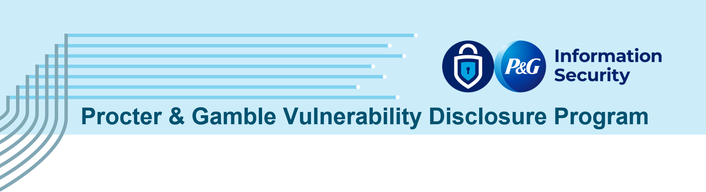

>_NOTE: This program **does not** provide monetary rewards for bug submissions, and it is used for responsible disclosure purposes only._

________________
The Procter & Gamble Company (P&G) is committed to providing secure products and services to our consumers. We recognize how important the security community is in keeping our products and our consumers safe. If you believe you have discovered a potential security vulnerability, privacy issue, exposed data, or other security issue with any of P&G’s applications, systems, products, or services, we want to hear from you. This policy outlines steps for reporting vulnerabilities to us, what we expect, and what you can expect from us. We value the positive impact of your work and appreciate your responsible disclosure.

# Safe Harbor
When conducting vulnerability research, according to this policy, we consider this research conducted under this policy to be:

- Authorized concerning any applicable anti-hacking laws, and we will not initiate or support legal action against you for accidental, good-faith violations of this policy;
- Authorized concerning any relevant anti-circumvention laws, and we will not bring a claim against you for circumvention of technology controls;
- Exempt from restrictions in our Terms of Service (TOS) and/or Acceptable Usage Policy (AUP) that would interfere with conducting security research, and we waive those restrictions on a limited basis; and
- Lawful, helpful to the overall security of the Internet, and conducted in good faith.

You are expected, as always, to comply with all applicable laws. If legal action is initiated by a third party against you and you have complied with this policy, we will take steps to make it known that your actions were conducted in compliance with this policy.

If at any time you have concerns or are uncertain whether your security research is consistent with this policy, please contact us at vdp@shared.pg.com before going any further.

> _NOTE: The Safe Harbor applies only to legal claims under the control of the organization participating in this policy, and that the policy does not bind independent third parties._

# Disclosure Policy
Privacy, data confidentiality, and integrity are crucial at P&G. By participating, you agree you will not disclose vulnerability information reported to P&G to any other third party. Public disclosure may be allowed upon request, and only after granted written permission to do so from P&G, through this program.

# Vulnerability Disclosure Process
To report a security issue, please use the GitHub Security Advisory ["Report a Vulnerability"](https://github.com/procter-gamble-vdp/submissions/security/advisories/new) tab. For detailed instructions on how to use the Security Advisories form, see our [README.md](https://github.com/procter-gamble-vdp/submissions/blob/main/README.md).

# Program Rules
- **Detailed Reports**: Please provide detailed reports with reproducible steps. 
- **One Vulnerability Per Report**: Submit one vulnerability per report, unless you need to chain vulnerabilities to provide impact.
- **Duplicate Reports**: When duplicates occur, we only recognize as valid the first report received (provided it can be fully reproduced).
- **Multiple Vulnerabilities**: Multiple vulnerabilities caused by **one underlying issue** are considered **one issue**.
- **Social Engineering Prohibited**: Social engineering attacks (e.g. phishing, vishing, smishing, etc.) are **prohibited**.
- **Ethical Conduct**: Make a good faith effort to avoid privacy violations, destruction of data, and interruption or degradation of our services. Only interact with accounts you own or with explicit permission of the account holder.

## Systems in Scope
This policy applies to any digital assets owned, operated, or maintained by The Procter & Gamble Company and Subsidiaries.

# Out of Scope Vulnerabilities
When reporting vulnerabilities, please consider (1) attack scenario / exploitability, and (2) security impact.

The following issues are considered out of scope:
- Unvalidated reports from automated scanning tools
- Any activity which could lead to the disruption of our service (DoS)
- Clickjacking on pages with no sensitive state changing actions
- Previously known vulnerable libraries without a working Proof of Concept
- Reports of insecure SSL/TLS ciphers (unless you have a working proof of concept, and not just a report from a scanner such as SSL Labs)
- Social engineering attacks (including phishing, vishing, smishing, etc.)
- Software version disclosure
- Issues requiring direct physical access to hardware (with the exception of hardware vulnerabilities found in P&G IoT/Smart products)
- Any physical attempt against P&amp;G property or facilities
- Flaws affecting out-of-date browsers and plugins
- Password complexity requirements, account/e-mail enumeration, or any report which discusses how you can learn whether a given username or email address has a P&G-related account
- Content Security Policy (CSP) Weaknesses which cannot be escalated into another vulnerability
- Email Spoofing
- Content spoofing and text injection issues without showing an attack vector/without being able to modify HTML/CSS
- Self-exploitation (e.g., cookie reuse)
- Missing security-related HTTP headers which do not lead directly to a vulnerability
- Presence of autocomplete attribute on web forms
- Missing secure cookie flags on non-sensitive cookies

## Our Commitments
When working with us, according to this policy, you can expect us to:
- Respond to your report promptly, and work with you to understand and validate your report;
- Strive to keep you informed about the progress of a vulnerability as it is processed;
- Work to remediate discovered vulnerabilities in a timely manner, within our operational constraints; and
- Extend Safe Harbor for your vulnerability research that is related to this policy.

# Response Targets
|  Response Target  |  Time (in business days)  | 
|--|--|
| First Response (from report submission)  |  within 2 days  |
| Triage (from report submission)  |  within 4 days  |
| Resolution  |  Dependent on severity and complexity  |  

We’ll keep you informed about our progress throughout the process.

# P&G US Brands
P&G is the parent organization for many brands. While many of these are obvious, some may not be. When submitting a potential security vulnerability, please perform due diligence to confirm P&G owns the affected brand. If you are unsure, please err on the side of notification and we will review your submission.

- A maintained list of US brands can be found at https://us.pg.com/brands/
- Other market brands are also in scope (e.g. https://pl.pg.com/marki-i-produkty/, https://www.pghongkong.com/en-us/brands-and-products/, etc.)
- Brands per location can be found at https://us.pg.com/locations/

Thank you for helping keep P&G and our customers safe and secure!
